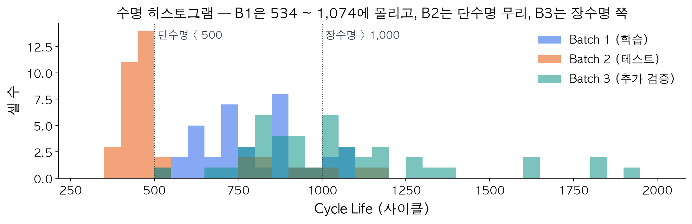
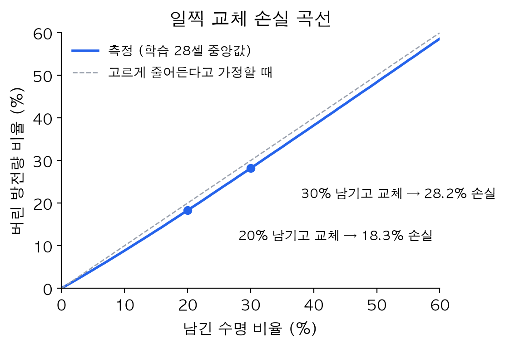
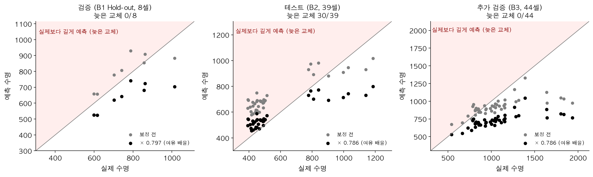
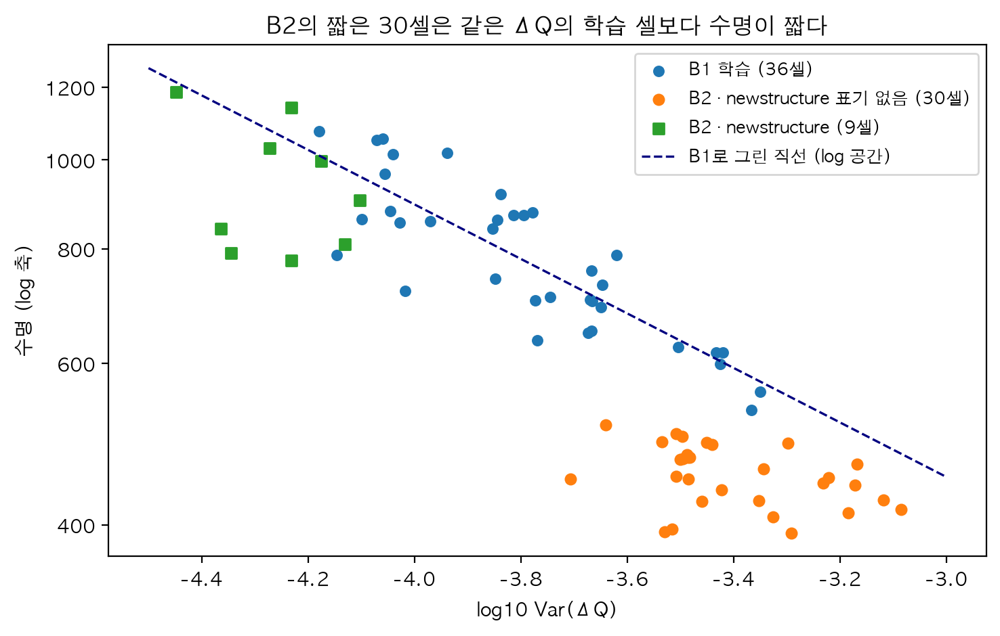
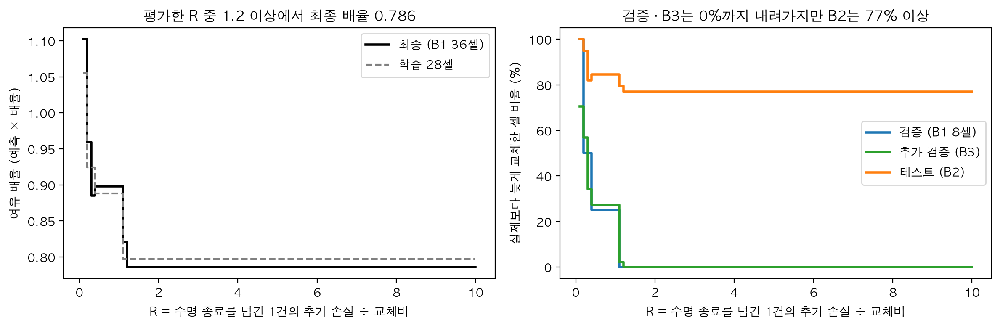

# ESS 배터리 수명 예측 — 초기 100사이클로 교체 시점 정하기

> 울산 1반 이승호 (U024) · DS 미니 프로젝트 2일차 (모델 개발 및 평가)

## 한눈에 보기

초기 100사이클의 방전 곡선 변화(ΔQ 분산)로 배터리 수명을 예측하고, 실제보다 늦게 교체하지 않도록 예측 수명에 여유 배율을 곱해 교체 시점을 정했다. 같은 배치(B1)의 검증 셀과 추가 배치(B3)에서는 늦은 교체가 없었지만, 테스트 배치(B2)에서는 39셀 중 30셀이 늦게 교체됐다. 원인은 B2 안의 특정 셀 묶음으로, 같은 충전 방식에서도 수명이 절반이었다.

| 항목 | 내용 |
|---|---|
| 데이터 | MIT-Stanford 배터리 셀 데이터. **B1**(Batch 1) = 학습, **B2** = 테스트, **B3** = 추가 검증 |
| 예측 방법 | 초기 100사이클의 방전 곡선 변화(ΔQ 분산) 하나로 수명(log 스케일)을 예측하는 직선 모델 |
| 선택 기준 | 학습 데이터 교차검증에서 **셀당 손실이 가장 작은 모델과 여유 배율**. 손실 = 일찍 교체하면 버린 방전량 비율, 늦게 교체하면 1건당 **R**. R = 늦은 교체 1건의 추가 손실 ÷ 배터리 교체비이고, 회사 값이라 0.1 ~ ∞를 모두 실험했다 |
| 대표 설정 | ElasticNet × **0.786** (예측 수명의 78.6% 시점에 경고). ElasticNet은 R ≥ 1.1부터 선택되고, 배율은 R = 1.1에서 0.821, 평가한 R ≥ 1.2에서 0.786이다. 1일차 원칙 "실제 수명보다 길게 예측하지 않기"는 늦은 교체 손실이 교체비보다 큰 경우에 해당한다. R이 0.4 ~ 1.0이면 선형회귀 × 0.898 (6-5) |
| 정확도 (배율 적용 전 MAPE) | 검증 9.0% · B2 38.8% · B3 14.1% (원논문 9.1%) |
| 늦은 교체 (배율 적용 후) | 검증 0/8 · B2 **30/39** · B3 0/44. 대가로 B3에서는 실제 수명보다 평균 28% 일찍 경고 |
| 한계 | 선택 과정까지 평가한 중첩 교차검증에서는 B1 안에서도 늦은 교체가 3 ~ 6/36 남았다 (7-2) |

읽는 순서: 모델 선정 과정은 **6-5**, 성능과 원논문 대비 시사점은 **7**, B2 실패 원인은 **8**, R별 의사결정은 **9-1**, 분석하면서 바꾼 판단은 **10**절에 있다.

## 1. 목적

ESS 운영사는 배터리가 **수명 종료(용량이 정격의 80%로 떨어지는 시점)에 닿기 전에** 교체하려 한다.
이 프로젝트는 초기 100번의 충·방전 데이터만으로 배터리 수명을 예측해 교체 시점을 미리 알려 주는 모델을 만든다.

예측 오류는 1. 실제 수명보다 짧게 2. 실제 수명보다 길게 두 방향으로 비용이 다르다.

| 오류 | 결과 | 비용 |
|---|---|---|
| 실제 수명보다 **짧게** 예측 (일찍 경고) | 직원이 점검하고 미리 교체 | 남은 수명만큼 배터리 가치를 덜 씀 |
| 실제 수명보다 **길게** 예측 (늦게 경고) | 수명 종료 후에도 계속 사용 | 출력 부족 · 고장 위험 → 공급 중단 · 위약금 · 긴급 교체 가능성 |

그래서 이 프로젝트는 ① 수명을 정확히 맞히는 모델과 ② **늦은 교체가 생기지 않도록 예측에 여유를 두는 기준**을 함께 만든다. 여유의 크기는 회사의 손실 비율에 따라 달라지므로, 손실 비율별 결과를 모두 제시한다.
※ 이 데이터의 타겟은 용량 기준 수명 종료 시점이다. 실제 고장 · 정지 기록이 아니므로, 손실 분석은 "수명 종료를 넘겨 쓰는 것을 위험 사건으로 간주한 시나리오"다.

## 2. 프로젝트 개요

| 항목 | 내용 |
|---|---|
| 데이터셋 | MIT-Stanford Battery Dataset (Severson et al., *Nature Energy*, 2019) — LFP(리튬인산철)/흑연 원통형 18650 셀, 정격 1.1Ah, 30℃ 챔버, 고속 충전 방식별 실험, 방전은 모두 4C |
| 학습 | Batch 1 (2017-05-12) — 36셀 = 선택용 28셀 + 검증용 8셀. 선택이 끝나면 36셀 전체로 다시 학습 (6-2) |
| 테스트 | Batch 2 (2018-02-20) — 39셀 |
| 추가 검증 | Batch 3 (2018-04-12) — 44셀 |
| 태스크 | **Regression** — 초기 100사이클 데이터 → `cycle_life` (방전 용량이 0.88Ah에 처음 닿는 사이클) |
| 지표 | MAPE (수명이 392 ~ 1,935로 넓어, 같은 100사이클 오차도 짧은 배터리에 더 치명적 → 비율 오차) |

**데이터 품질 처리 (원본 139셀 → 119셀)**

| 구분 | 발견 | 처리 | 근거 |
|---|---|---|---|
| 수명 값 결측 | B2 8셀(특수 충전 실험) · B3 2셀 | 셀 제외 (−10) | 정답이 없어 학습 · 평가 불가 |
| 수명 미확정 | B1 10셀: 0.88Ah 도달 전에 기록 종료 (끝 용량 0.92 ~ 1.04Ah) | 셀 제외 (−10) | 기록 끝을 수명으로 쓰면 정답이 실제보다 짧아짐 |
| 저항 결측 | B2 6셀: 저항이 전 구간 0으로 기록 | 셀 유지, 저항만 결측 처리 | 핵심 신호(ΔQ)는 정상 |
| 측정 오류 | 방전 용량 0.8 ~ 1.2Ah 밖(0 또는 2Ah 이상 스파이크), 저항 ≤ 0 | 그 값만 결측 처리 | 정격 1.1Ah · 정상 저항 범위에서 크게 벗어난 비정상 측정값 |
| 수명 극단값 | 장수명 쪽 통계적 이상치 (사분위 범위 기준) | 유지 | 실제로 일어난 값 |
| 초기 데이터 불안정 | B2 8셀: 초기 100사이클 안에서 연속 두 사이클 용량이 0.08 ~ 0.15Ah씩 뜀 | 셀 유지, 테스트 결과를 나눠서도 보고 | 모델 선택에는 쓰지 않는 점검 (6-2) |

**용어**

| 용어 | 뜻 |
|---|---|
| ESS · 셀 | ESS = 에너지 저장 장치. 셀 = 배터리의 개별 단위로, 이 데이터의 실험 · 예측 단위 |
| B1 · B2 · B3 | Batch 1 · 2 · 3. 같은 시기에 함께 실험한 셀 묶음 (2절 표) |
| C-rate | 충전 속도. 1C = 1시간에 완충하는 전류, 4C = 15분. C1 · C2 = 1단계 · 2단계 충전 속도 |
| 충전 방식 표기 `4.8C(80%)-4.8C` | 1단계 4.8C로 충전 상태(SOC) 80%까지, 이후 2단계 4.8C |
| `newstructure` | 원본 데이터의 일부 충전 방식 문자열 끝에 붙은 표기. 데이터 설명에 의미가 없어 무엇을 뜻하는지는 확인하지 못했다 |
| MAPE | 평균 절대 백분율 오차. 셀마다 예측과 실제의 차이(절댓값)를 실제 수명으로 나눈 값의 평균 × 100 |
| ΔQ(V) | 같은 전압에서 잰 100번째 − 10번째 사이클 방전 용량 차이 (6-1) |
| 교차검증 (CV) · fold | 데이터를 몇 묶음(fold)으로 나눠 돌아가며 한 묶음을 평가에 쓰는 방법 |
| Hold-out | 학습에 쓰지 않고 따로 떼어 둔 검증 데이터 |
| GroupKFold | 같은 그룹(여기서는 충전 방식)이 학습 · 검증 fold에 갈리지 않게 나누는 교차검증 |
| 교차검증 예측 (OOF) | 각 셀을 그 셀이 빠진 fold의 모델로 예측한 값 (out-of-fold) |
| 중첩 교차검증 | 선택 과정(피처 · 모델 · 여유 배율 고르기)까지 안쪽 교차검증에 넣고, 바깥 fold로 평가하는 방법 |
| ElasticNet `alpha` · `l1` | `alpha` = 규제 강도, `l1` = L1(계수를 0으로 만드는 규제) 비율 |
| 여유 배율 | 예측 수명에 곱하는 보정 배율. 0.79면 예측의 79% 시점에 경고. 늦은 교체 손실을 아주 작게(R ≤ 0.1) 보면 1을 넘기도 한다 |

## 3. 파일 구조

```
ess-battery-project/
├── data/
│   ├── README.md                 # 원본 받는 법 (원본 · pkl은 용량 때문에 제외)
│   └── processed/
│       ├── features.csv          # 셀 단위 피처 테이블 (139셀)
│       └── energy_curves_b1.csv  # B1 셀별 일찍 교체 손실 곡선
├── notebooks/
│   ├── 01_EDA.ipynb              # 데이터 품질 + 5가지 질문
│   ├── 02_feature_engineering.ipynb  # ΔQ 피처, 다중공선성, 후보 선택
│   └── 03_modeling.ipynb         # 분할 · 정렬 점검 · 후보 비교 · 손실 기준 · 성능표 · 오류 분석
├── src/
│   ├── config.py                 # 경로 · 상수 · 피처 목록 · 손실 비율 목록
│   ├── preprocess.py             # .mat → 셀 단위 데이터 + 품질 · 정렬 점검
│   ├── features.py               # 셀 단위 피처 테이블, 일찍 교체 손실 곡선
│   └── train.py                  # 분할 → 후보 비교 → 손실 기준 선택 → 테스트 → 성능표
├── results/
│   ├── model_performance.csv     # 과제 포맷 성능표
│   ├── cost_sensitivity.csv      # 손실 비율 R별 선택 결과 · 셀당 손실
│   ├── nested_cv.csv             # 선택 과정까지 포함한 B1 중첩 교차검증 (손실 기준, R별)
│   ├── nested_cv_accuracy.csv    # 중첩 교차검증 (정확도 기준, fold별)
│   ├── candidates_cv.csv         # 후보 34개 교차검증 결과
│   ├── predictions.csv           # 셀별 예측값
│   ├── energy_value_curve.csv    # 일찍 교체 손실 곡선
│   └── figures/                  # 노트북 그림
└── requirements.txt
```

## 4. 환경 설정 · 실행 방법

```bash
python3.11 -m venv .venv && source .venv/bin/activate
pip install -r requirements.txt

# 저장소만으로 (원본 없이) — 학습 · 선택 · 평가 전부 재현
python src/train.py          # results/*.csv (약 30초)

# 원본부터 전부 — data/raw/ 에 원본 .mat 3개를 넣고 (data/README.md)
python src/preprocess.py     # data/processed/b{1,2,3}.pkl
python src/features.py       # features.csv · energy_curves_b1.csv (+ 배치별 정렬 · 품질 점검 출력)
python src/train.py
```

- 노트북은 01 → 02 → 03 순서다. 03은 저장소만으로 실행되고, 01 · 02는 원본에서 만든 pkl이 필요하다 (세 노트북 모두 실행 결과가 저장돼 있다)
- 그림의 한글 글꼴은 macOS의 AppleGothic이다. 다른 OS에서는 노트북 첫 셀의 글꼴 이름을 바꾼다
- macOS에서 LightGBM을 불러올 때 오류가 나면 `brew install libomp`

## 5. EDA — 5가지 질문 (`notebooks/01_EDA.ipynb`)

1일차 과제 지시에 따라 B1 · B2 · B3의 분포를 비교했다. 피처 · 모델 결정의 근거 계산은 학습 배치(B1)에서 했다. 표의 r은 상관계수다.

| 질문 | 핵심 발견 | 모델링으로 |
|---|---|---|
| ① 수명 분포 | B1 534 ~ 1,074 (단수명 <500: 0, 장수명 >1,000: 5/36) · B2 단수명 28/39, **77%가 학습 최솟값(534) 아래** · B3 장수명 23/44 | 배치마다 분포가 다르다 → 학습 범위 밖까지 이어지는 선형 계열 |
| ② 열화 곡선 | 100사이클까지 용량 변화 중앙값 +0.22% · knee point(급격한 열화 시작점, 2구간 직선 근사) ≈ 수명 × 0.75 (r = 0.98) · knee point 이후 열화 10.5배 빠름 | 초기 용량 값으로는 구분 불가 → 곡선 모양을 본다 |
| ③ ΔQ(V) | log Var(ΔQ) ↔ log 수명 r = −0.84 / −0.92 / −0.76 (B1 / B2 / B3) | 핵심 피처 |
| ④ 충전 조건 | B1 충전 시간 r = 0.58, 1단계 속도 C1 r = −0.24 (C1 > 6 평균 719 vs C1 ≤ 5 평균 860) · B2 · B3 충전 시간은 대부분 10분대 초반(B3 일부 약 11분) | 충전 영향은 ΔQ에 이미 반영 → 충전 시간 제외 (6-1) |
| ⑤ 상관 · 다중공선성 | ΔQ 계열이 가장 강함 · ΔQ 분산 ↔ 최솟값 1.00, ↔ 평균 0.98 | ΔQ 계열은 분산 하나만 |

과제 안내에는 "B1과 B2는 분포가 비슷하다"고 되어 있지만, 이 과제 파일에서는 B2 수명이 B1보다 뚜렷이 짧았다(중앙값 472 vs 772). 1일차 EDA부터 이 차이를 전제로 진행했다.

추가 확인 — **같은 충전 방식이어도 셀마다 수명이 다르다.** B1에서 같은 방식으로 2셀씩 돌린 16개 방식을 보면, 충전 방식이 수명 차이의 85%를 설명하지만 짝 셀의 수명으로 예측하면 평균 9.8% 틀린다. 이 편차는 ΔQ와도 거의 관계가 없다(방식 안 편차끼리 r = −0.10). → 지금 피처로는 설명되지 않는 셀 단위 편차가 5 ~ 10% 수준 있고, 예측에 여유를 두는 근거 중 하나가 된다.



## 6. Modeling

### 6-1. 피처 엔지니어링 (`notebooks/02_feature_engineering.ipynb`)

**핵심 피처 ΔQ(V) 분산**
- `Qdlin`: 사이클마다 방전 용량을 공통 전압 눈금(3.5 → 2.0V, 1,000점)에 맞춰 다시 찍은 값
- **ΔQ(V) = Q₁₀₀(V) − Q₁₀(V)**, **`dq_var_log` = log10(Var_V[ΔQ(V)])** — 100번째와 10번째 방전 곡선이 얼마나 달라졌는지를 숫자 하나로
- 초기 100사이클만 사용한다 (그 이후 값은 예측 시점에 없는 미래 정보)

피처를 고르는 계산은 모두 **학습 28셀**로 했다 (검증 8셀 · 테스트 미사용).

| 구분 | 피처 | 근거 |
|---|---|---|
| 확정 | ΔQ 분산 | 수명과 r = −0.84 (B1) |
| 후보 → 탈락 (MAPE 기준) | ΔQ 왜도 · 용량 기울기(사이클 2 ~ 100) · 내부 저항 최솟값 · 평균 온도 | ΔQ 분산에 어떤 조합을 더해도 학습 교차검증 MAPE가 낮아지지 않음 (ΔQ만 7.98% → 하나 추가 시 최소 8.25%) |
| 제외 | 충전 시간 | ΔQ 분산과 r = −0.69, ΔQ를 반영한 뒤 남는 상관 0.05, 더하면 교차검증 7.98% → 8.37% |
| 제외 | 초기 용량 | 100사이클까지 거의 변하지 않아 수명별 차이 없음 |
| 제외 | ΔQ 최솟값 · 평균 | ΔQ 분산과 상관 0.98 ~ 1.00, 셋을 같이 넣으면 VIF 63 ~ 389 (VIF: 한 피처가 다른 피처들로 얼마나 설명되는지, 5 ~ 10을 넘으면 정보가 겹친다고 본다) |

- 확정 + 후보 5개의 VIF는 모두 5 미만(최대 4.90)이다. 후보가 탈락한 이유는 공선성이 아니라 **학습 28셀 교차검증에서 개선이 확인되지 않아서**다. 셀이 더 많으면 결과가 달라질 수 있다
- 탈락은 **MAPE 기준**이다. 손실 기준 선택(6-4 · 6-5)에서는 이 피처들도 후보 조합과 ElasticNet 입력으로 다시 비교했고, R ≥ 0.4에서는 ΔQ 분산 1개짜리 모델이, R ≤ 0.3에서는 후보를 더한 선형회귀가 뽑혔다
- 예측 대상은 **log10(수명)** 이다. 수명 분포가 오른쪽으로 길고, ΔQ 분산(log)과 직선 관계가 되기 때문이다. 따라서 이 README의 "직선"은 log 공간의 직선이다

### 6-2. 데이터 분할 — B1은 학습, B2는 테스트

```
B1 36셀 (학습 배치)
 ├─ 28셀 → 모델 학습 + 교차검증          → 성능표 "Train (B1 CV)"
 └─  8셀 → Hold-out 검증 (학습에 안 씀)  → 성능표 "Valid (B1 Hold-out)"
     ↓ 후보 비교 · 모델 선택이 끝나면 B1 36셀 전부로 다시 학습 = 최종 모델
B2 39셀 전부 → 테스트 1회                → 성능표 "Test (B2)"
B3 44셀 전부 → 추가 검증 1회             → 성능표 "Test (B3, 추가)"
```

| 역할 | 셀 | 충전 방식 | 분할 방법 |
|---|---|---|---|
| 학습 | B1 28 | 15 | — |
| 검증 (Hold-out) | B1 8 | 5 | 방식 20개를 평균 수명 순으로 세우고 4개마다 1개 → 수명 범위 전체에서 고르게 |
| 학습 안 교차검증 | — | — | `GroupKFold(5, groups=충전 방식)` |
| 최종 모델 학습 | B1 36 | 20 | 선택이 끝난 뒤 B1 전체로 다시 학습 |
| 테스트 | B2 39 (전부) | 12 | 보고 대상 모델에 1회 적용 |
| 추가 검증 | B3 44 (전부) | 8 | 보고 대상 모델에 1회 적용 |

- B2 · B3는 나누지 않고 전부 평가에만 쓴다. B1 안의 Hold-out 8셀은 과적합 확인용이다
- B1은 대부분 방식마다 2셀(짝 셀)이다. 짝 셀이 학습과 검증에 갈리면 검증 셀의 쌍둥이를 이미 본 셈이라 성능이 부풀려진다. 그래서 **방식 단위로** 나눴고, 학습 · 검증에 겹치는 방식은 없다
- 결측 대체 · 표준화는 `Pipeline` 안에 있어 교차검증 fold마다 학습 부분에만 맞춘다
- 피처 선택 · 모델 비교 · 여유 배율 선택은 학습 28셀로 한다. 코드도 B1 예측만으로 선택을 마친 뒤에 보고 대상 모델의 B2 · B3 예측을 만든다
- **테스트 독립성의 한계**: 1일차 EDA(과제가 지시한 배치 간 비교)에서 B2의 **수명 분포**와 "B1으로 그린 직선이 B2를 길게 예측하는 경향"을 이미 봤고, 이것이 선형 계열 + 여유 배율이라는 전략의 근거가 됐다. 따라서 B2는 모델 · 하이퍼파라미터 · 여유 배율을 고르는 데는 쓰지 않았지만, 완전히 모르는 데이터는 아니다

**배치 간 정렬 · 품질 점검** (과제 안내의 "배치마다 곡선 시작점 · 수집 공백이 다를 수 있음" 확인)

| 점검 | B1 | B2 | B3 |
|---|---|---|---|
| 초기 101사이클 사이클 번호 공백 | 0 | 0 | 0 |
| 10 · 100번째 사이클 Qdlin 있음 · 전압 눈금 일치 | 36/36 | 39/39 | 44/44 |
| 연속 두 사이클 방전 용량 급변 (중앙값) | 0.0013Ah | **0.0106Ah** | 0.0009Ah |
| Qdlin 시작값(3.5V 지점)의 최대 절댓값 — 용량 원점 | 0.0006Ah | 0.0016Ah | 0.0005Ah |
| Qdlin 끝값 − 요약 방전 용량 (중앙값) | −0.016Ah | **−0.040Ah** | −0.016Ah |
| 초기 데이터 품질 통과 (급변 ≤ 0.05Ah) | 36/36 | **31/39** | 44/44 |

B3는 점검한 모든 항목에서 B1과 같은 수준이라, 이 점검 범위 안에서 비교 가능하다고 봤다. 원시 방전 곡선은 저장하지 않아 보간 과정 자체는 확인하지 못했다. B2는 초기 데이터가 B1 · B3보다 불안정하고 방전 곡선 보간 값의 차이도 커서, 측정 · 수집 조건이 다른 배치일 가능성이 있다. 이 점검은 모델 선택에 쓰지 않고 테스트 결과를 나눠 보는 데만 쓴다(7-1).

### 6-3. 후보 모델 (1일차 전략)

| 후보 | 개수 | 선택 이유 |
|---|---|---|
| 선형회귀 (ΔQ 분산) | 1 | 기준선. 1일차 EDA에서 B2의 77%가 학습 범위 밖 → 직선 연장이 가능한 선형 계열 |
| 선형회귀 (ΔQ + 후보 조합) | 15 | 후보 피처를 교차검증으로 고르기 위해 |
| ElasticNet | 12 (alpha 4 × l1 비율 3) | 후보 4개 중 쓸모없는 피처를 L1 규제로 0으로 보내고, 셀이 36개뿐이라 계수를 줄여 과적합을 막기 위해 |
| 분위수 회귀 (하위 10 · 20%) | 4 | 실제보다 길게 예측하는 쪽에 벌점 (pinball 손실: 하위 분위수를 쓰면 실제보다 크게 예측한 오차에 더 큰 벌점) |
| 랜덤포레스트 · LightGBM | 2 | 비교용 — 학습 범위 밖 예측 한계 확인 |

딥러닝은 쓰지 않았다. 학습 셀이 36개뿐이고, 피처 하나로 수명 분산의 대부분이 설명되기 때문이다.

### 6-4. 선택 기준 — 회사 손실을 최소로

이 기준은 처음부터 정해 둔 것이 아니다. 처음엔 "학습 데이터에서 실제보다 길게 예측한 셀 20% 이하"로 시작했다. 이후 늦은 교체를 거의 0으로 줄이는 쪽으로 바꿨고, 늦은 교체와 일찍 교체의 비용 비율 문제를 거쳐, 가중치에 근거가 없어 R을 전 범위에서 실험하는 방식이 됐다 (10절).

셀 하나의 손실을 **배터리 1개 교체비** 단위로 정의한다.

| 경우 | 손실 | 값을 정한 방법 |
|---|---|---|
| 일찍 교체 | 남긴 수명 동안 더 내줄 수 있었던 **방전량 비율** | 실제 용량 곡선으로 측정 (선택에는 학습 28셀, 최종 배율에는 B1 36셀). 남긴 수명 10 / 20 / 30 / 50% → 방전량 8.8 / 18.3 / 28.2 / 48.4% |
| 늦게 교체 | 1건당 **R** (수명 종료를 넘겨 쓴 것의 추가 손실: 공급 중단 · 위약금 · 긴급 교체 할증) | 회사 값이라 알 수 없다 → **R = 0.1 ~ 3.0(0.1 간격), 5, 10, ∞ 의 33개 값을 모두 실험** (∞ = 늦은 교체를 어떤 대가를 치러도 피하는 경우) |

- **가정**: 배터리에 남은 경제가치는 앞으로 내줄 수 있는 방전량에 비례한다. 실제로는 전력 가격, 효율, 운영 일정에 따라 달라질 수 있다
- 용량은 knee point 이후 빨리 줄지만 1.07 → 0.88Ah 범위 안이라, 마지막 사이클도 처음의 80% 이상을 방전한다. 그래서 방전량 기준 가치는 거의 고르게 줄어든다
- 늦게 교체한 경우의 손실이 늦은 정도에 따라 얼마나 커지는지는 이 데이터로 알 수 없다(실험이 수명 종료 시점에서 끝남). 그래서 1건당 고정 손실로만 둔다
- R마다: 학습 28셀 교차검증 예측에 곱했을 때 **손실이 최소인 여유 배율**을 구하고, 그 손실이 가장 작은 모델을 고른다. 최종 모델은 B1 36셀로 다시 학습하고 여유 배율도 36셀 교차검증으로 다시 구한다
- 검증 8셀에는 학습용 배율을, B2 · B3에는 최종 배율을 곱한다



### 6-5. 최종 모델 — 선정 과정

| 단계 | 무엇을 | 기준 (사용 데이터) | 결과 |
|---|---|---|---|
| ① 피처 | ΔQ 분산 + 후보 4개의 조합 | 교차검증 MAPE (학습 28셀) | ΔQ 분산 1개가 가장 낮음 (7.98%) |
| ② 후보 모델 | 5계열 34개 | 교차검증 예측 만들기 (학습 28셀) | 후보마다 셀별 예측 |
| ③ 여유 배율 | 후보마다 예측 × 배율 | 셀당 손실 최소 (학습 28셀, R마다) | 후보마다 최적 배율 |
| ④ 모델 선택 | 34개 중 하나 | ③의 손실이 가장 작은 후보 (R마다) | R ≥ 1.1: ElasticNet (alpha 0.03, l1 0.9) · R 0.4 ~ 1.0: 선형회귀 (ΔQ 분산) |
| ⑤ 최종 학습 | 선택된 모델 | B1 36셀로 다시 학습, 배율도 다시 계산 | 배율 0.786 (R ≥ 1.2) · 0.821 (R = 1.1) · 0.898 (R 0.4 ~ 1.0) |
| ⑥ 평가 | 검증 8셀 · B2 · B3 | 한 번 적용 | 7절 |

**대표 설정은 ElasticNet (alpha = 0.03, l1 = 0.9) × 0.786이다.** 이 모델은 R ≥ 1.1에서 선택되고, 대표 배율 0.786은 평가한 R ≥ 1.2에 해당한다(R = 1.1에서는 0.821). 1일차에 "실제 수명보다 길게 예측하지 않기"를 원칙으로 정했고, 이는 늦은 교체 1건의 손실이 교체비보다 크다고 보는 것과 같다. 이 구간에서 ElasticNet은 규제로 후보 4개의 계수를 0으로 만들고 ΔQ 기울기를 줄였다. 그 결과 학습 데이터에서 늦은 교체 0건을 지키면서 일찍 교체 손실이 가장 작았다. 정확도(MAPE)만 보면 선형회귀(ΔQ 분산)가 가장 좋다(7.98%).

R 구간별 최종 모델

| R (늦은 교체 1건 손실 ÷ 교체비) | 최종 모델 | 여유 배율 (학습 28셀 → 최종 B1 36셀) |
|---|---|---|
| **1.1 이상** (평가한 값 기준) | ElasticNet (alpha = 0.03, l1 = 0.9) — 후보 4개의 계수가 모두 0이 되어 **ΔQ 분산 1개짜리 직선** | R = 1.1: 0.797 → 0.821 · 평가한 R ≥ 1.2: 0.797 → 0.786 |
| 0.4 ~ 1.0 | 선형회귀 (ΔQ 분산) | 0.888 → 0.898 |
| 0.1 ~ 0.3 | 후보 피처를 더한 선형회귀 | 9-1 표 |

## 7. 성능 결과

### 7-1. 과제 포맷 — 모델 자체의 정확도 (여유 배율 적용 전, MAPE %)

- Train은 학습 28셀 GroupKFold **fold별 MAPE의 평균**(± 표준편차)이다
- Target = 원논문(Severson 2019) 1차 테스트 MAPE **9.1%**
- Gap은 행 이름 그대로 **앞 − 뒤**로 계산했다. MAPE는 낮을수록 좋으므로 **Gap이 (−)이면 뒤 단계에서 오차가 커졌다**는 뜻이다
- 과제 안내의 "Gap이 (+)면 과적합"은 정확도처럼 높을수록 좋은 지표 기준이다. MAPE에서는 (−)가 그에 해당한다

| 구분 | **ElasticNet** (R ≥ 1.1 최종) | **선형회귀 ΔQ** (R 0.4 ~ 1.0 최종) | 분위수 회귀 20% | 랜덤포레스트 | LightGBM |
|---|---|---|---|---|---|
| Train (B1 CV) | 10.64 ± 1.40 | 7.98 ± 3.24 | 10.13 ± 1.45 | 10.98 ± 3.53 | 14.24 ± 1.95 |
| Valid (B1 Hold-out) | 9.03 | 10.52 | 7.65 | 11.45 | 16.08 |
| Test (B2) | 38.81 | 28.56 | 21.54 | 30.59 | 29.06 |
| Gap (Train−Valid) | +1.61 | −2.54 | +2.47 | −0.47 | −1.84 |
| Gap (Valid−Test) | −29.78 | −18.04 | −13.89 | −19.14 | −12.97 |
| Gap (Target−Test) | −29.71 | −19.46 | −12.44 | −21.49 | −19.96 |
| Test (B3, 추가) | 14.06 | 12.81 | 13.53 | 16.91 | 17.12 |
| Gap (B2−B3, 추가) | +24.75 | +15.75 | +8.01 | +13.68 | +11.94 |
| Gap (Target−Test, B3 기준) | −4.96 | −3.71 | −4.43 | −7.81 | −8.02 |
| 참고: Test (B2, 초기 데이터 품질 통과 31셀) | 39.97 | 30.15 | 22.05 | 31.58 | 28.42 |

Test (B2) 값은 모델 선택에 쓰지 않았다. 분위수 회귀가 B2에서 가장 낮지만(21.5%), 학습 데이터 기준 손실이 더 커서 어떤 R에서도 선택되지 않았다. `results/model_performance.csv`에는 MAPE 기준 ElasticNet 최선 모델(alpha 0.01, l1 0.5) 1개가 더 있다.

<details>
<summary>R 0.1 ~ 0.3 구간에서 선택된 두 모델의 성능표</summary>

| 구분 | 선형회귀 (ΔQ + 기울기 · 저항 · 온도) (R = 0.1) | 선형회귀 (ΔQ + 왜도 · 기울기) (R = 0.2 · 0.3) |
|---|---|---|
| Train (B1 CV) | 10.50 ± 3.20 | 9.25 ± 2.46 |
| Valid (B1 Hold-out) | 9.86 | 11.68 |
| Test (B2) | 24.29 | 30.86 |
| Gap (Train−Valid) | +0.65 | −2.43 |
| Gap (Valid−Test) | −14.44 | −19.18 |
| Gap (Target−Test) | −15.19 | −21.76 |
| Test (B3, 추가) | 11.48 | 16.91 |
| Gap (B2−B3, 추가) | +12.81 | +13.95 |
| Gap (Target−Test, B3 기준) | −2.38 | −7.81 |

</details>

### 7-2. 중첩 교차검증 — 선택 과정까지 포함한 B1 안 성능

위 Train · Valid는 같은 교차검증 예측으로 모델과 배율을 고르고 그 성과를 다시 본 것이라 낙관적일 수 있다. 그래서 B1 36셀을 바깥 5묶음(충전 방식 단위)으로 나누고, 바깥 학습 부분에서 **피처 조합 · 모델 · 여유 배율 선택을 처음부터 다시** 한 뒤 처음 보는 충전 방식의 셀에 적용했다 (`results/nested_cv.csv`, 정확도 기준은 `results/nested_cv_accuracy.csv`).

| 선택 기준 | 결과 (바깥 fold, B1 36셀) |
|---|---|
| 정확도(MAPE) 기준 선택 | MAPE **12.0%** (fold별 8.6 ~ 16.4%) — 학습 교차검증 최선값 7.98%보다 약 4%p 높다. fold마다 고른 피처 조합도 달랐다 |
| 손실 기준, R = 0.4 ~ 0.9 | 늦은 교체 5/36 · 평균 일찍 10 ~ 12% |
| 손실 기준, R = 1.0 | 늦은 교체 4/36 · 평균 일찍 15% |
| 손실 기준, R = 1.1 ~ 1.3 | 늦은 교체 6/36 · 평균 일찍 15% |
| 손실 기준, R ≥ 1.4 | 늦은 교체 **3/36 (8%)** · 평균 일찍 17 ~ 18% |

→ 학습 CV 0/28 · 검증 0/8은 낙관적인 숫자다. 선택 과정까지 감싸면 **B1 안에서도 늦은 교체가 약 8% 남을 수 있다**는 것이 더 정직한 추정이다. 셀이 36개뿐이라 선택이 흔들리고(R이 커져도 늦은 교체가 단조롭게 줄지 않음), 이것이 이 데이터의 핵심 한계다.

### 7-3. 여유 배율 적용 후 — 실제보다 늦게 교체한 셀

"평균 일찍"은 셀마다 max(실제 수명 − 보정 후 예측, 0) ÷ 실제 수명의 평균이다(늦게 교체한 셀은 0으로 포함).

| 구간 | 여유 배율 (학습 → 최종) | 학습 CV | 검증 | 테스트 B2 | 추가 B3 | 평균 일찍 (B3) |
|---|---|---|---|---|---|---|
| 평가한 R ≥ 1.2 (ElasticNet) | 0.797 → 0.786 | **0/28** | **0/8** | **30/39** | **0/44** | 28% |
| R = 1.1 (ElasticNet) | 0.797 → 0.821 | 0/28 | 0/8 | 31/39 | 1/44 | 25% |
| R 0.4 ~ 1.0 (선형회귀) | 0.888 → 0.898 | 2/28 | 2/8 | 33/39 | 12/44 | 11% |



### 7-4. Gap 해석

- **Gap (Train−Valid) −2.5 ~ +2.5%p** — 이번 분할에서 B1 안의 과적합은 크지 않다. 다만 검증이 8셀 한 번의 분할이라 강한 결론은 아니다
- **Gap (Valid−Test) −13 ~ −30%p** — 배치가 바뀌면 오차가 크게 커진다. 다만 Valid는 학습 28셀 모델, Test는 B1 36셀로 다시 학습한 모델의 결과라 재학습 효과도 조금 섞여 있다. 반면 B3에서는 MAPE가 11 ~ 17%로 B2보다 훨씬 낫다(7-1의 보고 모델 7개 기준, Gap (B2−B3) +8 ~ +25%p). 이번 결과에서 큰 오차는 **B2에서 특히 크게 나타났다** (원인 분석은 8절)
- **Gap (Target−Test) −12 ~ −30%p (B2), −2.4 ~ −8.0%p (B3)** (7-1의 보고 모델 7개 기준) — 원논문과 평가 조건이 달라 직접 비교하기 어렵다(아래 접힌 설명). 같은 배치 안 성능인 검증 MAPE는 선형 계열 7.7 ~ 11.7%로 원논문에 가깝지만, 선택 과정까지 포함한 중첩 교차검증 MAPE는 12.0%다 (7-2)
- **B2 품질 점검** — 품질 점검에서 용량이 급변한 8셀을 빼도 B2 MAPE는 비슷하거나 오히려 높다(기준선 28.6 → 30.2%). B2 오차는 그 8셀만으로는 설명되지 않는다. 배치 전체에 공통된 측정 차이까지 배제한 것은 아니다
- **최종 ElasticNet이 B2에서 가장 나쁜 이유** — 이 모델은 ΔQ 기울기를 기준선의 약 60%로 줄인 완만한 직선이다. 학습 범위 안에서는 여유 손실이 가장 작았지만, 짧은 수명 쪽으로 덜 내려가 짧은 셀이 많은 B2에서 크게 틀렸다. 테스트를 본 뒤 모델을 바꾸면 누수이므로 바꾸지 않고 그대로 보고한다

<details>
<summary>원논문과 평가 조건이 다른 이유</summary>

원논문은 세 배치 124셀을 학습 41 · 1차 테스트 43 · 2차 테스트 40으로 나눴고, 2차 테스트는 모델을 만든 뒤 추가로 실험한 셀이다 [2]. 9.1%는 학습과 함께 실험한 셀에서 잰 1차 테스트 값이다. 반면 이 과제는 학습과 테스트가 서로 다른 배치이고, 테스트 파일(2018-02-20)은 원논문이 쓴 세 배치(2017-05-12 · 2017-06-30 · 2018-04-12)에 포함되지 않는다 [4].

</details>

### 7-5. 원논문 대비 시사점

1. **배치 안에서는 원논문 수준을 재현했다** — 같은 배치 검증 MAPE 7.7 ~ 11.7%로 원논문 9.1%에 가깝다. 초기 100사이클의 ΔQ 분산 하나로 수명을 예측할 수 있다는 원논문의 핵심 주장은 이 데이터에서도 성립한다
2. **배치가 바뀌면 크게 나빠진다** — B2 MAPE 21.5 ~ 38.8%. 원논문의 9.1%는 학습과 함께 실험한 셀에서 잰 값이라, 새 생산 로트에 그대로 적용하면 이 정도 성능을 기대하기 어렵다. 실제 운영에는 로트별 재보정이 필요하다 (9-3)
3. **셀이 적으면 선택 과정 자체가 낙관 편향을 만든다** — 후보 34개 중 고르는 과정까지 감싸면 MAPE가 7.98% → 12.0%로 오른다. 셀 수십 개 규모에서는 성능을 중첩 교차검증으로 확인해야 한다 (7-2)

## 8. 오류 분석 — B2에서 크게 틀린 셀의 공통점

| B2 셀 | 셀 수 | 수명 | 오차 중앙값 (기준선 / 최종) | 초기 데이터 품질 통과 |
|---|---|---|---|---|
| 충전 방식 이름에 `newstructure` 표기 **없음** | 30 | 392 ~ 514 | **+32% / +44%** | 25/30 |
| `newstructure` 표기 있음 | 9 | 777 ~ 1,186 | +6% / −3% | 6/9 |

- **공통점** — 오차(절댓값)가 가장 큰 8셀 중 기준선은 7셀, 최종 ElasticNet은 8셀 모두가 `newstructure` 표기가 없는 셀이다. 표기 없는 30셀은 모두 학습 최솟값(534)보다 짧다. 1일차에 본 "테스트의 77%가 학습 범위 밖"이 바로 이 30셀이다. 최종 모델은 기울기가 완만해 이 셀들을 기준선보다 더 길게 예측했다
- **기록된 충전 조건으로는 설명되지 않는다** — 같은 명목 충전 방식인데 표기 유무로 수명이 약 2배 다르다 (중앙값 4.8C(80%)-4.8C: 492 vs 809 · 5.2C(58%)-4C: 483 vs 904 · 5.6C(26%)-4.5C: 446 vs 997). 오차와 충전 속도의 상관도 C1 r = −0.15, C2 r = −0.17로 약하다. 다만 기록되지 않은 충전 관련 요인까지 배제할 수는 없다
- **곡선 변화와 수명의 관계가 다르다** — 짧은 30셀 중 19셀은 ΔQ 분산이 학습 셀과 같은 범위(−4.18 ~ −3.35)에 있다. 같은 ΔQ의 학습 셀이 약 600사이클을 사는 동안 이 셀들은 약 450에서 끝났다
- **품질 점검의 급변 8셀만으로는 설명되지 않는다** — 6-2 품질 점검에서 용량이 급변한 8셀(위의 오차 상위 8셀과 다른 셀들)은 두 무리에 섞여 있고, 빼도 오차가 줄지 않는다. 배치 전체에 공통된 측정 차이는 배제하지 못했다
- **원인 가설** — `newstructure`는 원본 문자열 표기일 뿐 의미가 확인되지 않았다. 표기와 관련된 실험 구조 차이, 생산 로트, B2 배치의 측정 조건(6-2의 Qdlin 차이) 등 **배치 관련 차이가 유력한 가설**이다. 이런 요인이 수명을 줄였지만 초기 100사이클의 ΔQ에는 드러나지 않은 것으로 보인다. 확정하려면 실험 기록이 필요하다
- 테스트 결과를 본 뒤에 찾은 원인이므로 이번 모델에는 반영하지 않았다. 대응 방안은 9-3절에 정리했다



## 9. ESS 도메인 해석

### 9-1. 손실 비율 R별 의사결정 — 전체 결과

R = 수명 종료를 넘겨 쓴 1건의 추가 손실 ÷ 배터리 교체비. R마다 모델과 여유 배율은 학습 데이터(B1)만으로 골랐고, 검증에는 학습용 배율, B2 · B3에는 최종 배율을 적용했다. 결과가 같은 R은 한 행으로 묶었다. "평균 일찍"은 7-3절의 정의와 같다.

| R | 선택 모델 | 여유 배율 (학습 28셀 → 최종) | 늦은 교체: 학습 CV | 검증 | 테스트 B2 | 추가 B3 | B3 평균 일찍 |
|---|---|---|---|---|---|---|---|
| 0.1 | 선형회귀 (ΔQ + 기울기 · 저항 · 온도) | 1.055 → 1.102 | 15/28 | 8/8 | 39/39 | 31/44 | 3% |
| 0.2 | 선형회귀 (ΔQ + 왜도 · 기울기) | 0.924 → 0.959 | 5/28 | 4/8 | 37/39 | 25/44 | 5% |
| 0.3 | 선형회귀 (ΔQ + 왜도 · 기울기) | 0.924 → 0.885 | 5/28 | 4/8 | 32/39 | 15/44 | 9% |
| 0.4 ~ 1.0 | 선형회귀 (ΔQ 분산) | 0.888 → 0.898 | 2/28 | 2/8 | 33/39 | 12/44 | 11% |
| 1.1 | ElasticNet | 0.797 → 0.821 | 0/28 | 0/8 | 31/39 | 1/44 | 25% |
| 1.2 ~ ∞ (평가한 값) | ElasticNet | 0.797 → 0.786 | 0/28 | 0/8 | 30/39 | 0/44 | 28% |

<details>
<summary>R 33개 값 전체 결과 (같은 값이 반복되는 행 포함)</summary>

| R | 선택 모델 | 여유 배율 (학습 28셀) | 여유 배율 (최종) | 늦은 교체: 학습 CV | 검증 | 테스트 B2 | 추가 B3 | B3 평균 일찍 |
|---|---|---|---|---|---|---|---|---|
| 0.1 | 선형회귀 (ΔQ + 기울기 · 저항 · 온도) | 1.055 | 1.102 | 15/28 | 8/8 | 39/39 | 31/44 | 3% |
| 0.2 | 선형회귀 (ΔQ + 왜도 · 기울기) | 0.924 | 0.959 | 5/28 | 4/8 | 37/39 | 25/44 | 5% |
| 0.3 | 선형회귀 (ΔQ + 왜도 · 기울기) | 0.924 | 0.885 | 5/28 | 4/8 | 32/39 | 15/44 | 9% |
| 0.4 | 선형회귀 (ΔQ 분산) | 0.888 | 0.898 | 2/28 | 2/8 | 33/39 | 12/44 | 11% |
| 0.5 | 선형회귀 (ΔQ 분산) | 0.888 | 0.898 | 2/28 | 2/8 | 33/39 | 12/44 | 11% |
| 0.6 | 선형회귀 (ΔQ 분산) | 0.888 | 0.898 | 2/28 | 2/8 | 33/39 | 12/44 | 11% |
| 0.7 | 선형회귀 (ΔQ 분산) | 0.888 | 0.898 | 2/28 | 2/8 | 33/39 | 12/44 | 11% |
| 0.8 | 선형회귀 (ΔQ 분산) | 0.888 | 0.898 | 2/28 | 2/8 | 33/39 | 12/44 | 11% |
| 0.9 | 선형회귀 (ΔQ 분산) | 0.888 | 0.898 | 2/28 | 2/8 | 33/39 | 12/44 | 11% |
| 1.0 | 선형회귀 (ΔQ 분산) | 0.888 | 0.898 | 2/28 | 2/8 | 33/39 | 12/44 | 11% |
| 1.1 | ElasticNet | 0.797 | 0.821 | 0/28 | 0/8 | 31/39 | 1/44 | 25% |
| 1.2 | ElasticNet | 0.797 | 0.786 | 0/28 | 0/8 | 30/39 | 0/44 | 28% |
| 1.3 | ElasticNet | 0.797 | 0.786 | 0/28 | 0/8 | 30/39 | 0/44 | 28% |
| 1.4 | ElasticNet | 0.797 | 0.786 | 0/28 | 0/8 | 30/39 | 0/44 | 28% |
| 1.5 | ElasticNet | 0.797 | 0.786 | 0/28 | 0/8 | 30/39 | 0/44 | 28% |
| 1.6 | ElasticNet | 0.797 | 0.786 | 0/28 | 0/8 | 30/39 | 0/44 | 28% |
| 1.7 | ElasticNet | 0.797 | 0.786 | 0/28 | 0/8 | 30/39 | 0/44 | 28% |
| 1.8 | ElasticNet | 0.797 | 0.786 | 0/28 | 0/8 | 30/39 | 0/44 | 28% |
| 1.9 | ElasticNet | 0.797 | 0.786 | 0/28 | 0/8 | 30/39 | 0/44 | 28% |
| 2.0 | ElasticNet | 0.797 | 0.786 | 0/28 | 0/8 | 30/39 | 0/44 | 28% |
| 2.1 | ElasticNet | 0.797 | 0.786 | 0/28 | 0/8 | 30/39 | 0/44 | 28% |
| 2.2 | ElasticNet | 0.797 | 0.786 | 0/28 | 0/8 | 30/39 | 0/44 | 28% |
| 2.3 | ElasticNet | 0.797 | 0.786 | 0/28 | 0/8 | 30/39 | 0/44 | 28% |
| 2.4 | ElasticNet | 0.797 | 0.786 | 0/28 | 0/8 | 30/39 | 0/44 | 28% |
| 2.5 | ElasticNet | 0.797 | 0.786 | 0/28 | 0/8 | 30/39 | 0/44 | 28% |
| 2.6 | ElasticNet | 0.797 | 0.786 | 0/28 | 0/8 | 30/39 | 0/44 | 28% |
| 2.7 | ElasticNet | 0.797 | 0.786 | 0/28 | 0/8 | 30/39 | 0/44 | 28% |
| 2.8 | ElasticNet | 0.797 | 0.786 | 0/28 | 0/8 | 30/39 | 0/44 | 28% |
| 2.9 | ElasticNet | 0.797 | 0.786 | 0/28 | 0/8 | 30/39 | 0/44 | 28% |
| 3.0 | ElasticNet | 0.797 | 0.786 | 0/28 | 0/8 | 30/39 | 0/44 | 28% |
| 5 | ElasticNet | 0.797 | 0.786 | 0/28 | 0/8 | 30/39 | 0/44 | 28% |
| 10 | ElasticNet | 0.797 | 0.786 | 0/28 | 0/8 | 30/39 | 0/44 | 28% |
| ∞ | ElasticNet | 0.797 | 0.786 | 0/28 | 0/8 | 30/39 | 0/44 | 28% |

</details>



**R별 셀당 손실** (교체비 단위, 선택 모델 / 같은 R에서 최적 배율을 쓴 기준선 ΔQ 선형회귀)

| R | 학습 CV | 검증 | 테스트 B2 | 추가 B3 |
|---|---|---|---|---|
| 0.5 | 0.138 / 0.138 | 0.184 / 0.184 | 0.434 / 0.434 | 0.239 / 0.239 |
| 1.0 | 0.173 / 0.173 | 0.309 / 0.309 | 0.857 / 0.857 | 0.376 / 0.376 |
| 1.1 | 0.178 / 0.180 | 0.143 / 0.334 | 0.910 / 0.942 | 0.260 / 0.403 |
| 1.2 | 0.178 / 0.188 | 0.143 / 0.359 | 0.966 / 0.658 | 0.266 / 0.273 |
| 1.5 | 0.178 / 0.209 | 0.143 / 0.434 | 1.196 / 0.812 | 0.266 / 0.294 |
| 2.0 | 0.178 / 0.234 | 0.143 / 0.184 | 1.581 / 1.069 | 0.266 / 0.328 |
| 5.0 | 0.178 / 0.234 | 0.143 / 0.184 | 3.889 / 2.607 | 0.266 / 0.532 |

(R 0.4 ~ 1.0은 선택 모델이 기준선과 같다. 전체 R은 `results/cost_sensitivity.csv`)

- 고르는 모델은 세 계열로 나뉜다: R ≤ 0.3이면 후보 피처를 더한 선형회귀(거의 보정 없음), 0.4 ~ 1.0이면 ΔQ 선형회귀(최종 배율 0.898), 1.1 이상이면 ElasticNet이다. ElasticNet의 배율은 R = 1.1에서 0.821, **평가한 R ≥ 1.2에서 0.786**이다. 1.1과 1.2 사이 등 평가하지 않은 값의 전환점은 확인하지 않았다
- 회사가 먼저 답할 질문은 **"수명 종료를 넘긴 1건의 추가 손실이 교체비의 몇 배인가?"**다. 이 데이터 기준 시나리오로는 1.2배 이상이면 예측 수명 × 0.786, 0.4 ~ 1.0배면 × 0.898 시점에 점검 · 교체를 계획하게 된다. 현장 검증 전의 시나리오 결과다
- R ≥ 1.1의 ElasticNet은 학습 · 검증 · B3에서 기준선보다 손실이 작았지만, **R ≥ 1.2의 B2에서는 기준선보다 손실이 컸다**(R = 1.1만 예외). 즉 대표 설정 구간 전체에서 B2 손실은 기준선보다 크다. 기울기가 완만해 B2의 짧은 셀을 더 길게 예측했기 때문이다
- R ≥ 1.2에서 B3는 이번 관측에서 늦은 교체 0/44였고, 대가는 평균 28% 일찍 경고였다. 관측 결과일 뿐 다른 배치에서도 늦은 교체가 없다는 보장은 아니며, 중첩 교차검증으로는 B1 안에서도 약 8%가 남을 수 있다(7-2)
- **B2는 평가한 모든 R에서 30/39 이상 늦게 교체했다.** 학습 배치로 정한 여유가 B2에는 부족했고, 원인으로는 배치 관련 차이가 유력하다(8절). 배율 탐색 범위(0.6 ~ 1.2)와 1건당 고정 손실이라는 손실 모형도 결과에 영향을 줬을 수 있다

### 9-2. 한계

- **학습 셀 36개** — 여유 배율이 가장 짧게 산 셀 몇 개로 정해진다. R 1.0 → 1.1에서 늦은 교체가 2건 → 0건으로 계단처럼 바뀌는 것도 그 때문이다. 검증도 8셀 한 번의 분할이고, 선택 과정까지 감싼 중첩 교차검증에서는 늦은 교체가 3 ~ 6/36 남았다(7-2)
- **테스트 독립성** — B2의 수명 분포와 B1 직선 대비 위치는 1일차 EDA에서 봤고, 전략(선형 계열 + 여유 배율)의 근거였다 (6-2)
- **손실 모형** — 정답은 용량 기준 수명 종료이고 실제 고장 기록이 아니다. 늦을수록 손실이 얼마나 커지는지 볼 수 없어 1건당 고정 손실 R로 두었고, R 자체도 회사 값이라 비워 두고 전체 범위를 실험했다
- **일찍 교체 손실** — 경제가치가 남은 방전량에 비례한다고 가정했다. 전력 가격 · 수명 말기의 효율 저하 · 고장 위험은 들어가지 않았다
- **배치 차이** — B2의 짧은 30셀처럼 기록된 충전 조건 밖의 원인으로 수명이 달라지면, 초기 100사이클의 ΔQ만으로는 잡지 못한다
- **실험실 조건** — 30℃ 챔버에서 완전 충 · 방전을 반복한 데이터다. 현장 ESS는 온도 변화, 부분 충 · 방전, 휴지 기간이 있다

### 9-3. 실배포에 필요한 것

1. **로트별 재보정** — B1으로 정한 여유가 B2에서는 부족했다(9-1). 새 배치 · 생산 로트가 들어오면 일부 셀을 수명 끝까지 돌려 여유 배율을 다시 맞춘다
2. **메타데이터 기록** — B2 실패의 원인 후보(`newstructure` 표기, 측정 조건)를 확정하지 못했다(8절). 셀 구조 · 생산 로트 · 실험 조건을 함께 저장해 배치 차이를 설명할 수 있게 한다
3. **여러 배치로 학습** — 이번 모델은 B1 한 배치만 보고 배웠다. 여러 배치를 섞어 배치 차이까지 모델이 보게 한다
4. **회사 손실 비율 R 확정** — R을 몰라 전 범위를 실험했다(9-1). 공급 계약의 위약금, 정지 시 수익 손실, 긴급 교체비로 R을 계산해 9-1 표에서 여유 배율을 고른다
5. **점검 결과의 재학습 · 현장 데이터** — 데이터가 30℃ 실험실 조건이고 수명 종료 시점에서 끝난다(9-2). 경고 후 점검에서 확인한 실제 상태와 현장 운영 데이터로 다시 학습 · 검증한다

## 10. 의사결정 기록 — 분석하면서 바꾼 판단

1. **늦은 교체 허용 기준**: 처음엔 학습 데이터에서 실제보다 길게 예측한 셀 20% 이하로 잡았다. 늦은 교체를 "절대 피해야 할 오류"로 정해 놓고 20%를 허용하는 건 모순이라 거의 0으로 바꿨다.
2. **"절대 0"도 이상하다**: 늦게 3건 + 일찍 3건과 늦게 1건 + 일찍 6건 중 무엇이 더 손해인지는 비용 비율에 달렸다. 그래서 손실 함수로 바꿨다.
3. **가중치 근거**: 처음엔 배터리 가치가 고르게 줄어든다고 가정했다. 실제로 고르지 않다고 보고 용량 곡선으로 측정했더니, 방전량 기준으로는 거의 고르게 줄었다. 늦은 쪽 가중치(10배, 2배)는 근거가 없어 버렸다.
4. **한 값만 가정하지 않기**: 손실 비율 R을 0.1 ~ ∞의 33개 값으로 모두 실험해 표로 제시했다. 업계 자료는 부록에 참고로만 남겼다.
5. **분할 재확인**: B2는 나누지 않고 전부 테스트로 쓴다. 검증은 과제가 지정한 형식대로 B1 안의 Hold-out으로 한다.
6. **다시 검토하며 고친 것**: 검증 8셀이 피처 점검과 손실 곡선 계산에 섞여 있어 학습 28셀로 분리했다. 테스트 예측은 선택이 끝난 뒤에만 만들도록 순서를 바꿨다.
7. **낙관 편향 확인**: 중첩 교차검증 결과, 검증 0/8은 낙관적이었다. B1 안에서도 늦은 교체가 약 8% 남을 수 있다.
8. **B2 실패 원인 추적**: 충전 조건 → 데이터 품질(급변 8셀) → `newstructure` 표기 순으로 확인했고, 앞의 두 가설은 기각했다.

## 부록 A. 늦은 교체 손실 R — 공개 자료 참고

<details>
<summary>공개 자료 조사 결과 보기</summary>

이 분석은 R 값을 가정하지 않고 R별 결과를 모두 제시했다. 참고로 공개 자료를 찾아본 결과는 다음과 같다.

- **배터리 수명 종료 초과 · 고장 1건 손실 ÷ 교체비를 직접 제시한 공개 자료는 찾지 못했다**
- 일반 설비 기준으로, 예방 보전은 고장 후 대응보다 12 ~ 18%, 예지 보전은 예방 보전보다 8 ~ 12% 비용을 줄이고, 고장 후 대응에 의존하던 시설은 30 ~ 40% 넘게 줄일 수 있다고 제시된다 [5]
- 미국 ERCOT 시장의 한 ESS는 연간 가동률 96%를 유지했지만 수익이 몰린 날에 멈춰 연간 잠재 수익의 약 20%(약 $40,000/MW)를 놓쳤다 [6]. 정지 손실이 정지 시간 비율보다 훨씬 클 수 있다는 사례다
- 이 자료들로 R의 구체적인 값을 정할 수는 없다. 다만 정지 손실이 시간 비율보다 커질 수 있다는 점은 R이 작지 않을 가능성을 보여 준다

</details>

## 참고문헌

1. Severson, K. A. et al. Data-driven prediction of battery cycle life before capacity degradation. *Nature Energy* 4, 383–391 (2019).
2. Attia, P. M., Severson, K. A. & Witmer, J. D. Statistical learning for accurate and interpretable battery lifetime prediction. *Journal of The Electrochemical Society* (2021). https://doi.org/10.1149/1945-7111/ac2704 · [arXiv:2101.01885](https://arxiv.org/abs/2101.01885)
3. MIT-Stanford Dataset (Kaggle). https://www.kaggle.com/datasets/itshpark/data-driven-prediction-of-battery-cycle
4. Microsoft BatteryML, Data Preparation — MATR 배치 파일 목록. https://github.com/microsoft/BatteryML/blob/main/dataprepare.md
5. Sullivan, G. P. et al. *Operations & Maintenance Best Practices: A Guide to Achieving Operational Efficiency, Release 3.0*. PNNL for U.S. DOE FEMP (2010), 5장. https://www.energy.gov/sites/prod/files/2020/04/f74/omguide_complete_w-eo-disclaimer.pdf
6. Dekshenieks, A. ERCOT: The cost of unavailability for battery energy storage systems. Modo Energy (2024). https://modoenergy.com/research/ercot-battery-energy-storage-systems-availability-revenues-

## 팀 구성

| 이름 | 소속 | 역할 |
|---|---|---|
| 이승호 (U024) | 울산 1반 | 1인 — 데이터 처리 · EDA · 피처 · 모델링 · 평가 |
